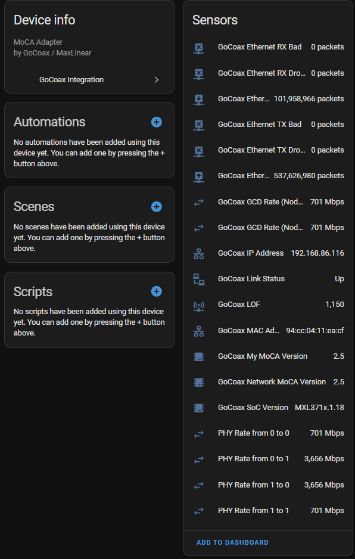
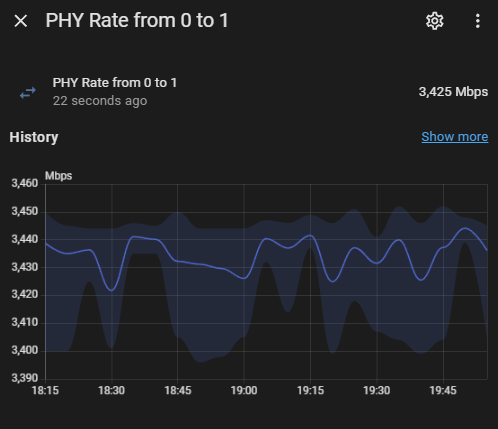

# GoCoax MoCA Integration for Home Assistant

A custom [Home Assistant](https://www.home-assistant.io/) integration to monitor and manage [GoCoax](https://www.gocoax.com) MoCA adapters. This integration uses direct HTTP requests (including Basic or Digest Authentication) to retrieve detailed MoCA link information, including:

- **Device Info**: SoC version, IP address, MAC, link status, etc.
- **Ethernet Stats**: TX good/bad/dropped counters, RX counters, etc.
- **PHY Rates**: Node-to-node MoCA link speeds in Mbps, plus GCD rates for each node.

Developed and tested with GoCoax MoCA 2.5 adapters, though it may work with other MaxLinear-based MoCA devices that expose similar endpoints.

---

## Features

- **Auto-Discovery** of multiple sensors:
    - **Link Status** (`Up`/`Down`)
    - **Ethernet TX/RX counters**
    - **SoC and MoCA versions**
    - **LOF** (Link Failure Count)
    - **Node-to-Node PHY Rates** (Mbps) for all discovered MoCA nodes
    - **GCD Rates** for each node
- **Config Flow**–Based: add it in **Settings → Devices & Services → Add Integration**
- **No YAML** required (though you can override intervals in the code)
- **Local Polling** (no cloud required)

---

## Table of Contents

- [Installation](#installation)
    - [Option A: Via HACS (Recommended)](#option-a-via-hacs-recommended)
    - [Option B: Manual Install](#option-b-manual-install)
- [Configuration](#configuration)
- [Usage](#usage)
    - [Sensors](#sensors)
    - [Viewing PHY Rates](#viewing-phy-rates)
- [Troubleshooting](#troubleshooting)
- [License](#license)

---

## Installation

### Option A: Via HACS (Recommended)

If you have [HACS](https://hacs.xyz/) installed:

1. **Add Custom Repository** (one-time):
    1. In Home Assistant, open **HACS** → **Integrations**.
    2. Click the **3 dots** (top-right) → **Custom repositories**.
    3. Add the URL of this repository (e.g., `https://github.com/dewgenenny/hagocoax`) with **Category** set to **Integration**.
    4. Click **Add**.
2. **Install the Integration**:
    1. Return to **HACS** → **Integrations**.
    2. Search for **GoCoax** (or find it under Custom Repositories).
    3. Click **Install**.
3. **Restart Home Assistant**.
4. After restarting, go to **Settings → Devices & Services → Add Integration**, search for **GoCoax**, and select it.

### Option B: Manual Install

1. **Download** the contents of this repository (e.g., via ZIP or Git clone).
2. In your Home Assistant `config` directory (where `configuration.yaml` lives), create a folder called **`custom_components`** if it does not already exist.
3. Copy the entire **`gocoax`** folder (containing `__init__.py`, `config_flow.py`, `sensor.py`, etc.) into **`custom_components`**
4. **Restart Home Assistant**.
5. Go to **Settings → Devices & Services → Add Integration**, search for **GoCoax**, and select it.

---

## Configuration

After installation:

1. In Home Assistant, navigate to **Settings → Devices & Services**.
2. Click **Add Integration** (the `+` in the bottom-right).
3. Search for **GoCoax**.
4. Enter:
- **Host** (IP or hostname) of your GoCoax device
- **Username** (e.g. `admin`)
- **Password**
5. The integration will validate the credentials and create a new config entry upon success.
6. A new **GoCoax** device will appear in your Devices & Services list, along with multiple sensors.

---

## Usage

### Sensors

Once set up, Home Assistant automatically creates sensors for:

- **SoC Version** (e.g., `MXL371x.1.0.4`)
- **Link Status** (`Up` or `Down`)
- **Ethernet TX/RX counters**:
- `TX Good`, `TX Bad`, `TX Dropped`
- `RX Good`, `RX Bad`, `RX Dropped`
- **IP Address**, **MAC Address**
- **LOF** (Link Failure Count)
- **My MoCA Version**, **Network MoCA Version**

All sensors update periodically (default every 60 seconds). You can change the poll interval in the code by editing `DEFAULT_SCAN_INTERVAL` in `const.py`.

### Viewing PHY Rates

The integration also calculates **node-to-node PHY Rates** in Mbps, plus a **GCD rate** for each node. For each pair of nodes (`node_from`, `node_to`), you'll see a sensor named:

- `sensor.phy_rate_from_0_to_1` (for node 0 → node 1, in Mbps)
- `sensor.go_coax_gcd_rate_node_0` for node 0’s GCD rate, etc.

If multiple MoCA nodes appear on your network, you’ll see multiple from→to sensors. New nodes discovered after the integration is running may require a reload of the integration to add new sensors.

---

## Troubleshooting

**Common issues**:

1. **Link Status / Data Not Updating**
- Verify the device’s IP/host is correct and the credentials match your adapter’s settings.
- Check logs in **Developer Tools → Logs** for errors.

2. **Missing Sensors**
- If new MoCA nodes appear, reload or remove/re-add the integration so it can discover them.
- Make sure you’re running the updated version that includes PHY rates.

3. **Cannot Connect / Invalid Auth**
- Double-check the password or see if the adapter needs Digest Authentication.
- In `gocoax_api.py`, switch from basic to `HTTPDigestAuth` if required.

For other issues, open an issue on [GitHub](https://github.com/yourusername/gocoax-homeassistant/issues).

---

## License

This project is licensed under the [MIT License](LICENSE). All product names, logos, and brands are property of their respective owners. This project is not officially affiliated with or endorsed by GoCoax, Inc. or MaxLinear.
